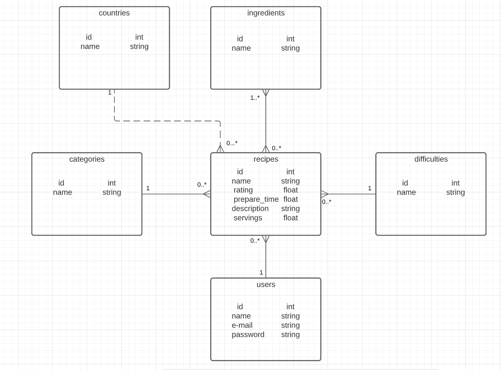

# C.R.U.D Recipes
This is an entire recipe website planned by myself.
I am planning to use everything that I've learned working on this repo.

## Database schema

note: this is the basic database schema, the final one can suffer alterations and it's alterations will be documented here.

## Business Rules
  Here you can find the rules of the database relations just in case it isn't very clear.
   - A recipe should have one category. But a category can be in many recipes. We can also have a category that don't have any recipe yet.
   - A recipe should be made by one and only one user. A user can write zero or many recipes.
   - A recipe should have a difficulty and a difficulty can be used in zero or many recipes.
   - The recipe should have at least one ingredient. An ingredient can be present in zero or many recipes.
   - A recipe can have an origin country and an origin country can have zero or many recipes.
