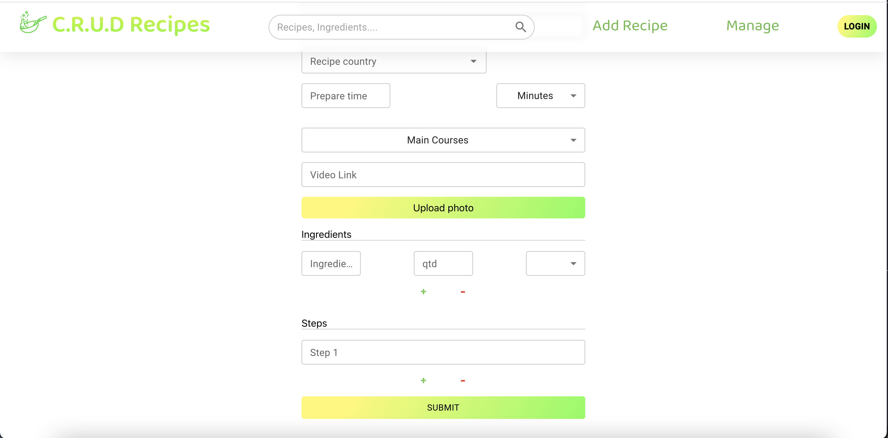

# C.R.U.D Recipes

 ⭐️ Note: If you are not a developer, or you just want to see the final result I recommend you to go to [section 7](#mobile-web-application).

## Content

 1. [About](#about)
 2. [What a user can do](#what-a-user-can-do)
 3. [Application Architecture](#application-architecture)
 4. [Application Details](#application-details)
    - [Front-End](https://github.com/janpeter123/crud_recipes/tree/main/front-end)
    - [Back-End](https://github.com/janpeter123/crud_recipes/tree/main/back-end)
 5. [Technologies Used](#technologies-used)
 6. [Database Schemas](#mongodb-schemas)
 7. ["Business Rules"](#business-rules)
 8. [Web Application Review](#mobile-web-application)
    - [Mobile](#mobile-web-application)
    - [Desktop](#desktop-web-application)

## About

This is a recipe web application developed with the `mobile first` concept. So the mobile application was developed first and optimized to small screens, the smallest screen that it was developed was an `Iphone SE` that is not one of the smallest phones on the market today.
For the Desktop version it was developed and tested only on a `13" monitor`. I tried to develop based on relative measures, this way it shouldn't be a big issue if you try to execute on a different screen size.

## What a user can do

A user can create and rate any recipe without the need of logging in but only the admin user can delete or update recipes. Such as names or descriptions.

 # Application architecture
 

# Application Details
  This application consists of two independent parts the [Front-End](https://github.com/janpeter123/crud_recipes/tree/main/front-end) and the [Back-End](https://github.com/janpeter123/crud_recipes/tree/main/back-end).
  
  - See more about the Front-End [here](https://github.com/janpeter123/crud_recipes/tree/main/front-end)
  - See more about the Back-end [here](https://github.com/janpeter123/crud_recipes/tree/main/back-end)
 
 
 ## Technologies used:
 Front-End
 -----
  - [React.js](https://reactjs.org/)
  - [React Router](https://reactrouter.com/)
  - [Mongoose](https://mongoosejs.com/)
  - [MUI](https://mui.com/)

Back-End
----
  - [MongoDB hosted on AWS](https://www.mongodb.com/)
  - [Express.js](https://expressjs.com/)
  - [Google Firebase Storage](https://firebase.google.com/docs/storage/web/start)
  - [Passport.js](https://www.passportjs.org/)

## MongoDB schemas

## Schemas description

#### • Recipes
  
Field | Description
----|----
_id| Primary Key
author|User
recipe_name | Name of the recipe
date | Publication date
country | Recipe country of origin
prepare_time | Prepare time of the recipe
prepare_time_unit | Time unit of the prepare time. Can be Hours, Minutes, Days
video_link | Youtube or another video Link of the recipe
main_photo | The photo that will be displayed on the main page of the app
photo_album | Recipe Image gallery, More images of the recipe
Ingredients_list | Ingredients used on this recipe
description | Recipe Steps of how to do it
reviews | User reviews
review_count | How many people had reviewed a recipe

note: this is the basic database schema, the final one can suffer alterations and it's alterations will be documented here.

## Business Rules
  Here you can find the rules of the database relations just in case it isn't very clear.
   - A recipe should have one category. But a category can be in many recipes. We can also have a category that don't have any recipe yet.
   - A recipe should be made by one and only one user. A user can write zero or many recipes.
   - A recipe should have a difficulty and a difficulty can be used in zero or many recipes.
   - The recipe should have at least one ingredient. An ingredient can be present in zero or many recipes.
   - A recipe can have an origin country and an origin country can have zero or many recipes.

## Mobile Web Application
### Home / Landing Page

Description:

Home with drawer/menu closed | Home with Drawer/menu open

## Recipe Page
This is the page you go if you click on a recipe card.

 

## Add recipe Page (Form)

 

## Desktop Web Application
### Home / Landing Page

## Recipe Page

## Add recipe Page (Form)

